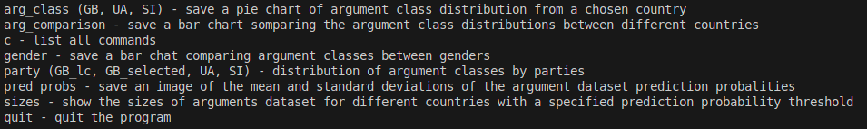
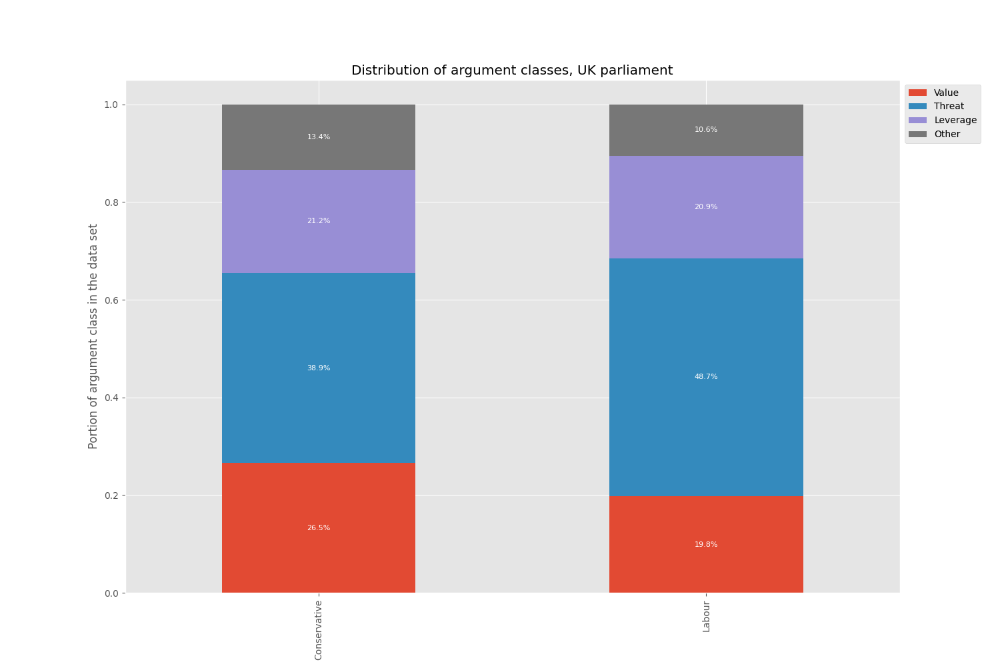
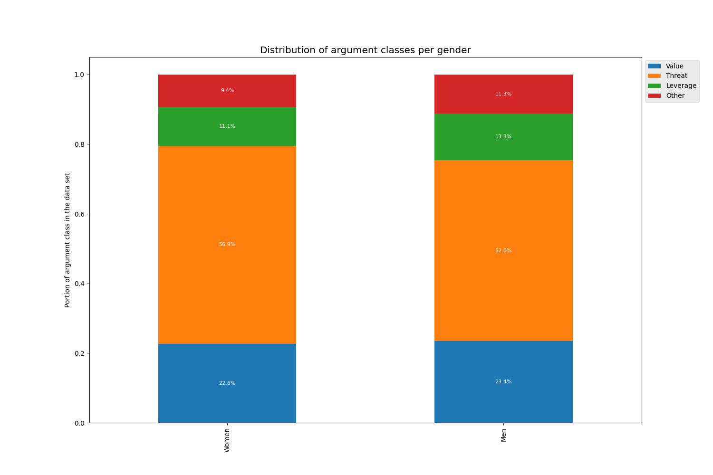
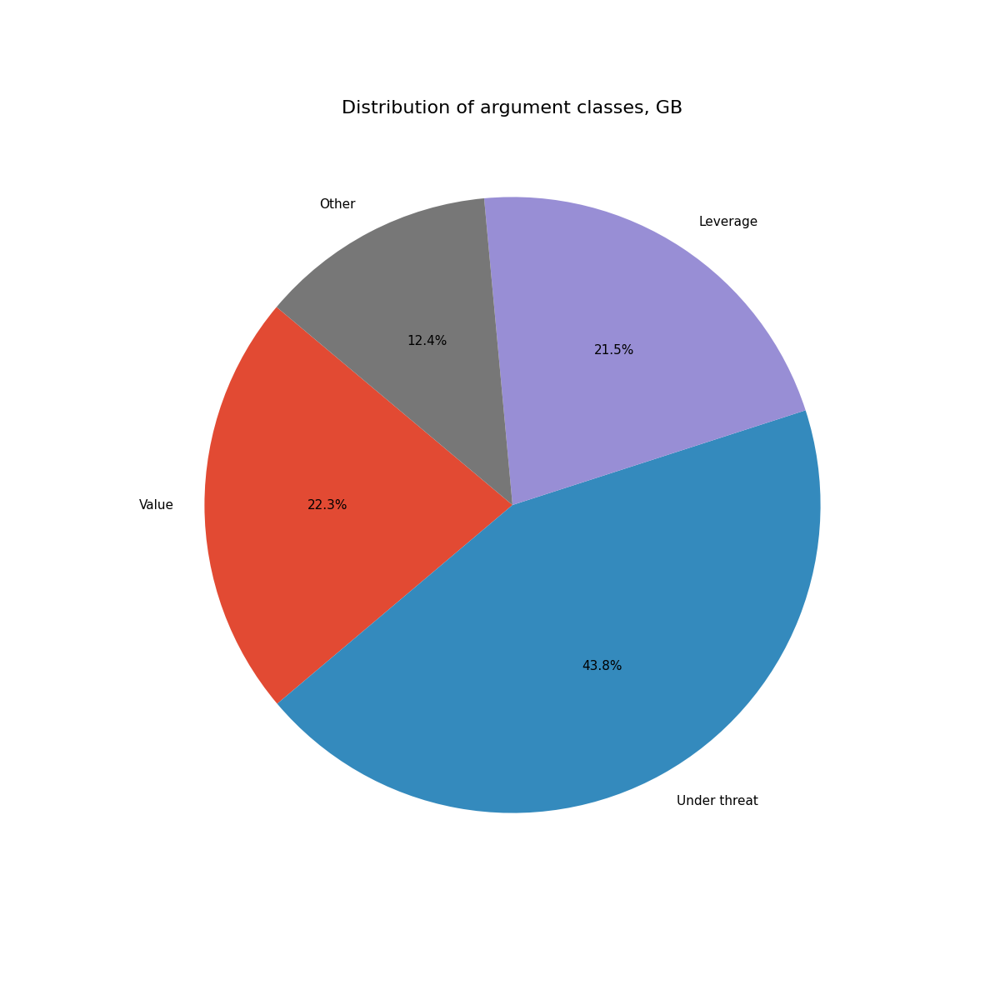

# Distribution Plotting Tool, DHH 2024

A plotting tool for the argument class dataset constructed in the [Digital Humanities Hackathon 2024](https://www.helsinki.fi/en/digital-humanities/helsinki-digital-humanities-hackathon-2024-dhh24) by the Parliament group.  

### Echoes of the Chambers: Studying Democracy through Parliamentary 

The hackathon team build a model to classify parliamentary speeched based on, how democracy is used as an argument in the speeches. The four categories, developped by humanities experts, were democracy under threat, as a value, as leverage and other. More information about the model and codes used to build the model [here](https://github.com/kferraga/ParliamentHackathon2024).  

More information about the hackathon and pictures from the event days in the [Hackathon website](https://www.helsinki.fi/en/digital-humanities/helsinki-digital-humanities-hackathon-2024-dhh24) and [instagram](https://www.instagram.com/dhhackathon/).  

## Distribution tool

The terminal distribution tool is used to visual some of the results found in the argument class data set.

### Installation and packages

To use the tool, clone the repository to your computer. Packages needed listed below.

* (Pyhton3)[https://www.python.org/downloads/]
* (Pandas)[https://pandas.pydata.org/docs/getting_started/install.html]
* (Numpy)[https://numpy.org/install/]
* (Matplotlib)[https://matplotlib.org/stable/install/index.html]

### User guide

The program has multiple options for visualization. 

Start the program with the command:  

´´´
python3 init.py
```


The commands can be listed with the option "c".  



The programs stops with the "quit" command.  

### Example figures



